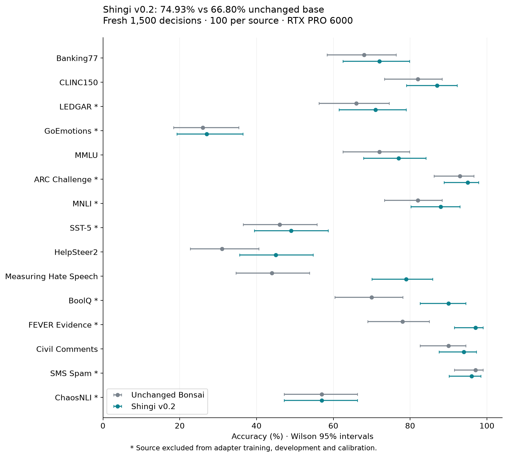
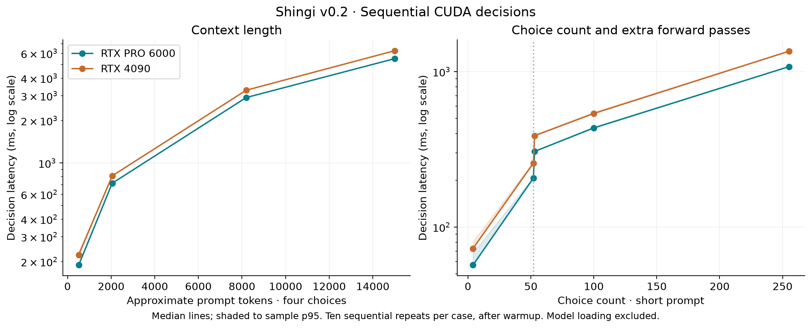

# Shingi — 審議

Local decision models: choices, probabilities, and scores from candidate logits.

Shingi (Japanese for deliberation) adapts **Bonsai 2 27B** for request-defined
decisions. Give it context, a question, and possible answers. It reads every
candidate's logit directly, without generating an explanation or parsing prose.

CUDA v0.2 combines the compact ternary base with a **132.03 MiB decision
adapter**, freshly trained without share-alike fitting datasets. On the
[fresh 1,500-record test](results/cuda-v0.2/REPORT.md), accuracy is **74.93%**
versus **66.80% for the base** and **74.47% for the old adapter** on the RTX PRO
6000. The new adapter scores **75.00% on the RTX 4090**.

NLL and ordinal-score error improve over the old adapter, but calibration error
worsens. HelpSteer2, SMS Spam and ChaosNLI lose correct answers. The small
aggregate accuracy gain over v0.1 has a paired interval that includes zero.
This is an experimental model; GoEmotions remains weak at 27%. See the
[model card](release/README.md) for the full tradeoffs and limitations.



## Run locally

Target hardware: **RTX 4090** and **RTX PRO 6000 Blackwell**, Linux x86-64.
Follow [CUDA installation](docs/cuda.md) to build the pinned public Prism runtime,
download the unchanged base, and load the Shingi adapter and calibration.

```bash
uv sync --locked
bash scripts/setup_cuda.sh
nvidia-smi -L
export CUDA_VISIBLE_DEVICES=GPU-YOUR-FULL-UUID
uv run --locked shingi \
  --model artifacts/base/Ternary-Bonsai-2-27B-PQ2_0.gguf \
  --adapter artifacts/shingi-v0.2/adapter.gguf \
  --calibration artifacts/shingi-v0.2/calibration.json
```

Use a complete UUID printed by `nvidia-smi`. The API listens on
`http://127.0.0.1:8765`. Shingi does not manage services or require any Kortexa
infrastructure. The setup builds from public source; model files stay outside Git.

## CUDA measurements

| GPU | Mixed median / p95 | Sampled GPU allocation |
|---|---:|---:|
| RTX PRO 6000 Blackwell | 81 / 612 ms | 8.47 GiB |
| RTX 4090 | 107 / 755 ms | 8.27 GiB |

These are 900 sequential decisions from 300 fixed records, with loading
excluded and a 16K context allocation. Longer prompts and larger option sets
cost more; the [full curves and method](results/cuda-v0.2/REPORT.md) show both.
Memory is sampled every 100 ms and can miss brief peaks. The 6000 retained
six production services; the 4090 retained an unrelated GPU process. These
measurements do not establish a speedup over v0.1.



## Interface

`POST /v1/systemone` accepts text or JSON state and named questions:

| Primitive | Result |
|---|---|
| Choice | Selected key and probabilities for every supplied choice |
| Noul | Probability that the supplied statement is true |
| Score | Expected ordinal score and probabilities for every level |

The [API contract](docs/api-contract.md) documents TypeSafe SDK compatibility,
model identity, calibration, error responses, and confidence semantics. Up to
52 choices use one forward pass; 53–255 use approximate chunk-and-anchor scoring
and need multiple passes. Questions run sequentially. Context is capped at
16,384 tokens, with an explicit error for oversized inputs.

## Evidence and scope

- [Frozen external benchmarks](results/external-v1/REPORT.md): 8,122 questions
  from This/That, DecisionBench Medium/Hard and public JevBench, with unchanged
  v0.2 weights and calibration. Includes attributed Jev-Omni reported scores
  and the limits of that comparison.
- [CUDA v0.2 release measurements](results/cuda-v0.2/REPORT.md): matched fresh
  base/adapter results on both GPUs, source holdouts, calibration, order and
  context checks, repeated latency/memory measurements, and live SDK checks.
- [Unchanged-base investigation](results/baseline-v1/REPORT.md): RTX 4090 feasibility
  and live SDK checks, 1,500 decisions, option-order and synthetic context tests.
- [Fresh Apache adapter training](results/training-v2/REPORT.md): six fitting
  sources, frozen development selection, independent calibration and native export checks.
- [Historical v0.1 release](results/cuda-v0.1/REPORT.md): the first adapter and
  its original test; those percentages use different records.
- [First adapter experiment](results/training-v1/REPORT.md): matched base/adapter
  quality, calibration, source holdouts, native export agreement, RTX PRO 6000
  inference and training resource measurements.
- [Evaluation protocol](docs/evaluation-protocol.md): data separation, exact
  candidate logits, failure accounting, and attributed third-party comparisons.

Nine sources are excluded from v0.2 training, development and calibration.
Choice keys are sorted before inference, making map reordering deterministic;
this does not establish learned invariance. A separate input-order diagnostic
still changes 14/200 adapter answers. Cross-GPU answers agree on 99.73% of the
test, with mean probability TVD 0.00280. The approximate multi-pass method can
produce large individual probability differences; see the full report.

The original ternary scales and transforms are preserved. The adapter is
separate FP32 LoRA weights; this is not a merged all-ternary model.

No hosted Jev benchmark is run by this project. Historical Jev comparisons are
explicitly labeled reanalyses of attributed public predictions. Percentages on
different datasets are not a controlled comparison with OpenJev or other models.

Text and JSON are supported; screenshot inputs are not. A 24 GB M3/M4 Mac is a
future deployment target. CUDA results do not establish Mac memory or speed.
Metal/MLX work and alternative weight formats follow quality validation.

## Development

```bash
uv sync --locked
uv run --locked pytest -q
```

The training path uses `uv sync --locked --extra training`, a separate numerical
and backward canary, frozen ternary base weights expanded for training, and
native GGUF adapter export. It needs 96 GB class GPU capacity; inference memory
measurements are not training requirements. Research scripts accept explicit
paths and never change system services. Keep training, development, calibration,
and locked evaluation data separate. Retain checkpoints and reproducible records.

## License and attribution

Repository code and the fresh v0.2 adapter are **[Apache-2.0](LICENSE)**.
The historical v0.1 adapter retains CC BY-SA 4.0.
Upstream model, runtime, and dataset licenses remain separate. See the [Bonsai base](https://huggingface.co/prism-ml/Ternary-Bonsai-2-27B-gguf),
[Prism runtime](https://github.com/PrismML-Eng/llama.cpp), and
[OpenJev](https://huggingface.co/openjev/openjev), whose public decision interface
and methods informed this independent project. See [NOTICE](NOTICE) and the [source-by-source release review](docs/release.md).
