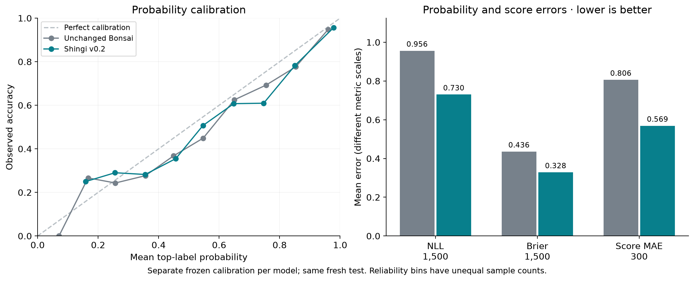
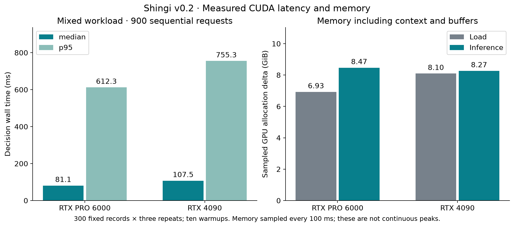

# Shingi — 審議 — Bonsai 2 27B decision adapter v0.2

Shingi is an experimental local decision model for **request-defined choices,
probabilities, and ordinal scores**. It reads all candidate logits from Bonsai
and returns structured results without generating an explanation.

This repository contains a **132.03 MiB FP32 LoRA adapter**, calibrated readout
parameters, evaluation charts, and a checksum manifest. Download the unchanged
ternary Bonsai base separately. Use the [Shingi CUDA runtime](https://github.com/kortexa-ai/shingi)
with the pinned Prism fork; this adapter is not a standalone model or a generic
Transformers/PEFT adapter. Created using Bonsai by Prism ML.

## What changed

Version 0.2 trains a fresh adapter using six sources with CC BY, MIT or CC0
terms. ARC and BoolQ are excluded from training, development selection and
calibration. No previous adapter weights, optimizer state or fitted calibration
were reused. The **new adapter is Apache-2.0**; the historical v0.1 adapter keeps
its CC BY-SA 4.0 license.

Rank-8 LoRA with alpha 16 adds **34,603,008 trainable parameters** to the gate,
up and down MLP projections of all 64 layers. Original ternary weights, scales
and transforms remain unchanged. The selected checkpoint is **update 559**,
with separate probability calibration. No adapter merge or additional release
quantization was performed.

Choice-map reordering is stable because keys are sorted before inference.
Renaming choices, changing their wording, or varying the underlying prompt
order can still change the result. Score levels retain their supplied order.

## Run on CUDA

Tested targets are Linux x86-64, RTX 4090, and RTX PRO 6000 Blackwell. Install
Python 3.11+, `uv`, Git, CMake, a C++17 compiler, the Hugging Face CLI, and CUDA
12.8+ with a compatible driver. The measured build used CUDA 13.0.88.

```bash
git clone https://github.com/kortexa-ai/shingi.git
cd shingi
uv sync --locked
export PATH=/usr/local/cuda/bin:$PATH
bash scripts/setup_cuda.sh
hf download prism-ml/Ternary-Bonsai-2-27B-gguf \
  Ternary-Bonsai-2-27B-PQ2_0.gguf LICENSE NOTICE.txt \
  --revision 6ed5e12bf84b7a63069882c91dd9e9218647d17b \
  --local-dir artifacts/base
# Place the supplied adapter bundle in artifacts/shingi-v0.2.
nvidia-smi --query-gpu=name,uuid,memory.free --format=csv
export CUDA_VISIBLE_DEVICES=GPU-YOUR-FULL-UUID
uv run --locked shingi \
  --model artifacts/base/Ternary-Bonsai-2-27B-PQ2_0.gguf \
  --adapter artifacts/shingi-v0.2/adapter.gguf \
  --calibration artifacts/shingi-v0.2/calibration.json
```

Use a complete GPU UUID from `nvidia-smi`. Startup verifies model and adapter
checksums against calibration. The API binds to `127.0.0.1:8765`.

```bash
curl -s http://127.0.0.1:8765/v1/systemone \
  -H 'Content-Type: application/json' \
  -d '{"model":"shingi","state":"The parcel arrived damaged. Please replace it.","questions":{"route":{"type":"choice","instructions":"Select the handling team.","criteria":{"returns":"Damage and replacements","billing":"Charges and refunds","shipping":"Delivery tracking"}}}}'
```

The [API contract](https://github.com/kortexa-ai/shingi/blob/main/docs/api-contract.md)
describes Choice, Noul (truth probability), Score, and real TypeSafe SDK support.
Shingi needs no Kortexa service or private runtime. It serves sequentially,
reads every candidate logit, and rejects oversized inputs without truncation.
The context limit is 16,384 tokens. Up to 52 choices need one pass; 53–255 use
approximate chunk-and-anchor scoring with multiple passes.

## Training and data

The selected checkpoint saw **4,466 prompts from 2,233 distinct records and
1,073,860 input tokens**. The prepared pool held 2,284 records from Banking77,
CLINC150, MMLU, HelpSteer2 helpfulness, Measuring Hate Speech and Civil Comments.
JevBench supplied transformations at revision
`002ad22de8db2df5e0eb898b3da8072dbd4af4de`. The pool reused 378 permitted earlier
training records. All published validation/test states and prior project
evaluation records were excluded from training. New development and calibration
data exclude every earlier project split by ID and canonical state hash.

Two deterministic option permutations were prepared per training record;
102 prompts over 1,024 tokens were excluded without truncation. Training used
candidate cross entropy against human vote distributions where available,
otherwise the gold label: batch one, accumulation eight, AdamW, learning rate
`5e-5`, 32 warmup updates, cosine decay and gradient clipping at 1. The run
completed one prepared epoch, 559 updates, with zero skipped optimizer steps.
No hosted Jev predictions were training targets.

Checkpoint selection used minimum uncalibrated NLL on **192 development records**.
Update 559 reduced development NLL to 0.626760. Its accuracy was 75.52%, below
update 512's 76.56%; the selection rule used NLL and was set before training.
Native development predictions agreed with the selected differentiable model
on all 192 selected answers, with mean probability TVD 0.001770. This is measured
agreement, not exact numerical equivalence. The
[training record](https://github.com/kortexa-ai/shingi/blob/main/results/training-v2/REPORT.md)
and bundled `training-provenance.json` retain source audit and measurements.

The canonical Choice readout was fixed before the run. Calibration uses a
separate **180 records**: 150 Choice/Score and 30 Noul. The new adapter's global
temperature is 1.5; Noul additionally divides by 1/3, with zero log-odds bias.
The unchanged base has its own calibration. The old adapter retains its original
240-record calibration for the matched comparison.

Weights and calibration were frozen before drawing the fresh **1,500-record
test**, 100 per source. It excludes **10,708 previous IDs and 10,708 state hashes**.
Nine sources were excluded from every v0.2 fitting stage: ARC Challenge, BoolQ,
LEDGAR, GoEmotions, MNLI, SST-5, FEVER Evidence, SMS Spam and ChaosNLI. Their
absence from adaptation does not prove absence from upstream pretraining;
that overlap is unknown. No test result selected or tuned the release.

## Accuracy and probability quality

On the fresh test, **Shingi v0.2 scores 1124/1,500 (74.93%)**
versus **1002/1,500 (66.80%)** for unchanged Bonsai on the RTX PRO 6000.
The paired gain is **+8.13 percentage points**, with a descriptive
95% bootstrap interval of **+6.00 to +10.27 points**.

| Calibrated metric | Unchanged Bonsai | Shingi v0.1 | Shingi v0.2 |
|---|---:|---:|---:|
| Accuracy, 1,500 records | 66.80% | 74.47% | 74.93% |
| NLL, 1500 records | 0.95619 | 0.78501 | 0.73016 |
| Multiclass Brier, 1500 records | 0.43559 | 0.35008 | 0.32850 |
| Expected-score MAE, 300 records | 0.80599 | 0.64199 | 0.56875 |
| Distance to human labels, 400 records | 0.40500 | 0.35830 | 0.32314 |
| Top-label ECE, 1,500 records | 0.05147 | 0.02697 | 0.04734 |

| GPU, same fresh test | v0.1 correct | v0.2 correct | Paired change, 95% interval |
|---|---:|---:|---:|
| RTX PRO 6000 | 1117/1,500 | 1124/1,500 | +0.47 pp [-0.93, +1.87] |
| RTX 4090 | 1116/1,500 | 1125/1,500 | +0.60 pp [-0.80, +2.00] |

**The new adapter is not better on every metric.** ECE worsens on both cards.
On the 6000, HelpSteer2 falls from 48 to 45 correct answers, SMS Spam from
99 to 96, and ChaosNLI from 60 to 57, each out of 100. The 4090 has the same
HelpSteer2 and SMS losses; ChaosNLI falls from 60 to 58. NLL, Brier and
expected-score error improve overall. The accuracy intervals against v0.1
include zero, so these small aggregate gains do not establish a clear advantage.

Each adapter retains its own frozen calibration; this compares the packaged
models rather than isolating weight changes. No test-time adjustment was made.

On the nine sources excluded from v0.2 fitting, accuracy improves from
615/900 (68.33%) to 670/900 (74.44%) against the base
(paired interval +3.67 to +8.56 points). This does not establish general
unseen-domain reliability. GoEmotions remains weak at 27/100.




The [full report](../results/cuda-v0.2/REPORT.md) retains every measured regression,
denominators, intervals and per-source results. The
[machine-readable evidence](../results/cuda-v0.2/summary.json) also includes
uncalibrated old/new comparisons. Score accuracy uses the modal level;
expected-score error and distance to human vote targets are reported separately.

## CUDA latency and memory

| GPU | Mixed median / p95 | Sampled inference allocation | Model initialization |
|---|---:|---:|---:|
| RTX PRO 6000 | 81.1 / 612.3 ms | 8.47 GiB | 1.17 s |
| RTX 4090 | 107.5 / 755.3 ms | 8.27 GiB | 9.11 s |

| GPU | Old / new mixed median | Old / new mixed p95 | Short SDK median / p95, new |
|---|---:|---:|---:|
| 6000 | 81.50 / 81.12 ms | 613.75 / 612.26 ms | 51.0 / 58.0 ms |
| 4090 | 107.17 / 107.48 ms | 755.57 / 755.29 ms | 70.5 / 73.8 ms |




The mixed workload uses 300 fixed records, 20 per source, repeated three times
after ten warmups. Synthetic curves use ten measured repeats per case. Short
HTTP timings use 30 localhost SDK requests after three warmups. Request wall
time includes tokenization, GPU memory checks and all candidate passes. Loading
is separate; model initialization excludes artifact checksum hashing.

The RTX PRO 6000 retained six running production services during inference;
the RTX 4090 retained one unrelated GPU process. Old and new adapters used the
same source, native executable and workload, with sequential runs. Other
workload activity and filesystem cache were uncontrolled. Small timing changes
are not evidence of a speedup. Hardware was an Intel Core i9-14900K, CUDA
13.0.88 and driver 610.43.02, with power limits of 450 W (6000) and 480 W (4090).

Memory is the increase in device allocation over the pre-load baseline,
sampled every 100 ms with a 16,384-token context and Q8 KV cache. A brief peak
can be missed, and the measurements are not isolated to one process. Host RSS
was sampled only after readiness, so it does not establish a host load-time
peak. CUDA memory figures do not establish feasibility on a 24 GB Mac.

## Cross-GPU agreement

The RTX 4090 scores **1,125/1,500 (75.00%)** versus **1,004/1,500 (66.93%)**
for unchanged Bonsai. Shingi agrees across GPUs on
**1496/1,500 decisions (99.73%)**, with mean probability TVD **0.00280**.
The base agrees on 1493/1,500 (99.53%), with mean TVD 0.00485.
Both pass the predeclared 99% agreement and 0.01 mean-TVD thresholds.

This is not exact numerical equivalence. Three requests per model select a
different intermediate chunk winner and therefore a different final comparison
prompt. All static prompts and candidate token IDs match, and every adaptive
path was checked by replay. The new adapter's maximum individual TVD is
**0.34677**, on a 77-choice Banking77 request. Small hardware-dependent
logit changes can produce large probability shifts in this approximate method.

Both cards pass 12/12 synthetic context probes and all live SDK checks,
including 52, 53 and 255 choices, map reordering and explicit oversized-input
errors. Raw input-order changes flip 14/200 new-adapter answers on each card.
Canonical map reordering has zero flips on both cards; this is an interface
property, not learned model invariance.

## Limitations

This is one small adaptation experiment, primarily on English benchmark text.
It does not establish general reliability, fairness, or robustness to prompt
injection. Evaluate the model on your own domain before delegating decisions.
Confidence fields describe distribution concentration, not a guarantee of
correctness. Calibration can change under a new workload.

Source samples contain only 100 records each, and the aggregate gives every
source equal weight. Order sorting does not remove label or wording sensitivity.
The synthetic context tests check simple planted-fact retrieval, not real-document
comprehension. More than 52 choices use an approximate probability composition.
Images, audio and video are unsupported. No M3/M4 Mac performance, concurrency
throughput, hosted Jev comparison, or generation-token speed is claimed.

## Files, identity and license

- `adapter.gguf`: SHA-256 `6f4c2b7434b5ef6e0bb83b6f9c196de00c850a79b9380175e06a1df2ae1b7dd2`.
- Required base: `Ternary-Bonsai-2-27B-PQ2_0.gguf`, revision `6ed5e12bf84b7a63069882c91dd9e9218647d17b`, SHA-256 `3907dc1658db1f78a9826bf8d5bcb8dc65db0d466388937af57f2294fae62ec1`.
- Native runtime: PrismML-Eng/llama.cpp revision `d8f26eec76da6d09bb708bcba51ef64b8cd868a3`.
- `calibration.json` binds calibration to both weight hashes and the readout version.
- `protocol.json` records the pre-test freeze; `manifest.json` lists every bundled file and checksum.
- `evaluation/` contains aggregate metrics and data identifiers; `figures/` contains PNG and SVG charts. Raw datasets and prompts are not redistributed.

The **v0.2 adapter, Shingi-authored documentation and software are Apache-2.0**.
The unchanged Bonsai base is Apache-2.0 and the Prism runtime is MIT. Third-party
materials retain their own terms. The six fitting sources use CC BY 4.0,
CC BY 3.0, MIT or CC0; their attribution and pinned license documents are retained.
Evaluation-only datasets have separate terms. The historical v0.1 weights
remain CC BY-SA 4.0. See the
[source review](https://github.com/kortexa-ai/shingi/blob/main/docs/release.md),
[NOTICE](../NOTICE) and bundled `licenses/`.

Bonsai is by Prism ML, based on Qwen by Alibaba Cloud. JevBench transformations
are by Praveenrajus / uspraveen and retain the underlying sources' attribution.
OpenJev's Apache-licensed helper and the MIT TypeSafe adapter informed the
readout and interface. Shingi includes no OpenJev weights and is not endorsed
by those upstream projects.
