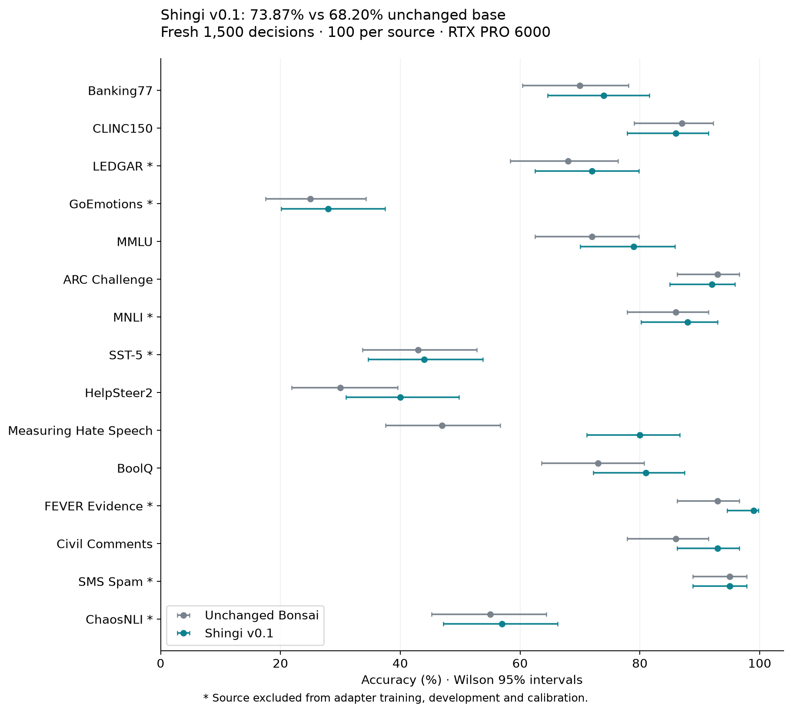
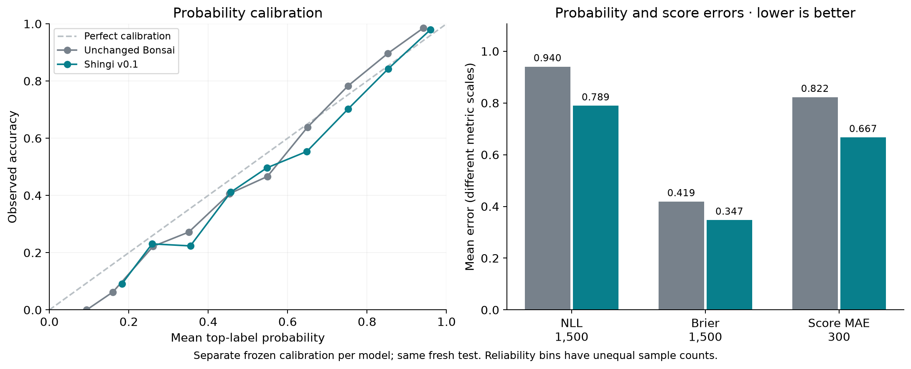
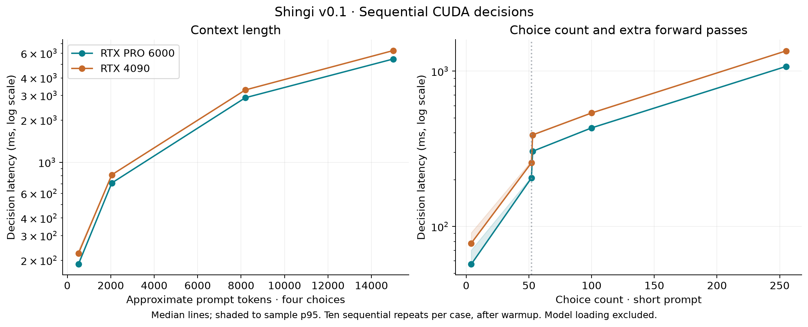
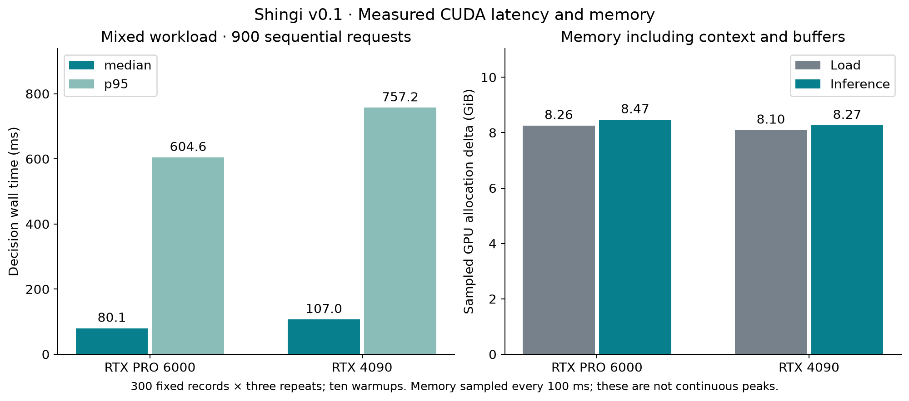

# Shingi — 審議 — Bonsai 2 27B decision adapter v0.1

Shingi is an experimental local decision model for **request-defined choices,
probabilities, and ordinal scores**. It reads all candidate logits from Bonsai
and returns structured results without generating an explanation.

This repository contains a **132.03 MiB FP32 LoRA adapter**, calibrated readout
parameters, evaluation charts, and a checksum manifest. Download the unchanged
ternary Bonsai base separately. Use the [Shingi CUDA runtime](https://github.com/kortexa-ai/shingi)
with the pinned Prism fork; this adapter is not a standalone model or a generic
Transformers/PEFT adapter. Created using Bonsai by Prism ML.

## What changed

Rank-8 LoRA with alpha 16 adds **34,603,008 trainable parameters** to the gate,
up, and down MLP projections of all 64 layers. The original ternary base,
quantization scales, and transforms remain unchanged. The release uses the
selected update-128 checkpoint, separate probability calibration, and a
canonical lexicographic ordering of Choice keys. No adapter merge or additional
release quantization was performed.

Choice-map reordering is stable because keys are sorted before inference.
Renaming choices, changing their wording, or varying the underlying prompt
order can still change the result. Score levels retain their supplied order.

## Run on CUDA

Tested targets are Linux x86-64, RTX 4090, and RTX PRO 6000 Blackwell. Install
Python 3.11+, `uv`, Git, CMake, a C++17 compiler, the Hugging Face CLI, and CUDA
12.8+ with a compatible driver. The measured build used CUDA 13.0.88.

```bash
git clone https://github.com/kortexa-ai/shingi.git
cd shingi
uv sync --locked
export PATH=/usr/local/cuda/bin:$PATH
bash scripts/setup_cuda.sh
hf download prism-ml/Ternary-Bonsai-2-27B-gguf \
  Ternary-Bonsai-2-27B-PQ2_0.gguf LICENSE NOTICE.txt \
  --revision 6ed5e12bf84b7a63069882c91dd9e9218647d17b \
  --local-dir artifacts/base
hf download kortexa-ai/shingi-bonsai-2-27b-v0.1 \
  --local-dir artifacts/shingi-v0.1
nvidia-smi --query-gpu=name,uuid,memory.free --format=csv
export CUDA_VISIBLE_DEVICES=GPU-YOUR-FULL-UUID
uv run --locked shingi \
  --model artifacts/base/Ternary-Bonsai-2-27B-PQ2_0.gguf \
  --adapter artifacts/shingi-v0.1/adapter.gguf \
  --calibration artifacts/shingi-v0.1/calibration.json
```

Use a complete GPU UUID from `nvidia-smi`. Startup verifies model and adapter
checksums against calibration. The API binds to `127.0.0.1:8765`.

```bash
curl -s http://127.0.0.1:8765/v1/systemone \
  -H 'Content-Type: application/json' \
  -d '{"model":"shingi","state":"The parcel arrived damaged. Please replace it.","questions":{"route":{"type":"choice","instructions":"Select the handling team.","criteria":{"returns":"Damage and replacements","billing":"Charges and refunds","shipping":"Delivery tracking"}}}}'
```

The [API contract](https://github.com/kortexa-ai/shingi/blob/main/docs/api-contract.md)
describes Choice, Noul (truth probability), Score, and real TypeSafe SDK support.
Shingi needs no Kortexa service or private runtime. It serves sequentially,
reads every candidate logit, and rejects oversized inputs without truncation.
The context limit is 16,384 tokens. Up to 52 choices need one pass; 53–255 use
approximate chunk-and-anchor scoring with multiple passes.

## Training and data

The selected checkpoint saw **1,024 prompts from 939 distinct records and
227,768 input tokens**. The prepared pool had 3,084 records from eight sources:
Banking77, CLINC150, MMLU, ARC Challenge, HelpSteer2 helpfulness, Measuring Hate
Speech, BoolQ, and Civil Comments. JevBench supplies the benchmark transformations
at revision `002ad22de8db2df5e0eb898b3da8072dbd4af4de`.

Training used candidate cross entropy against human vote distributions when
available, otherwise the gold label; batch size 1, accumulation 8, AdamW,
learning rate `5e-5`, 32 warmup updates, cosine decay, gradient clipping 1, and
1,024-token prompts. Paired randomized option orders were prepared. The checkpoint
was selected by lowest NLL on 256 development records. The run stopped after
401 updates following development-based early stopping; later checkpoints were
not selected. No hosted Jev predictions were training targets.

The release readout's sorting rule passed a predeclared development gate:
accuracy changed from 212/256 to 209/256 and NLL from 0.509250 to 0.520816.
Calibration uses a separate 240-record split. The adapter's global temperature
is 1.25; Noul additionally divides by 1.2 and adds a log-odds bias of −1.
The unchanged-base comparator has its own calibration from the same split.

The fresh release test has 1,500 records, 100 per source, and excludes all 6,930
previous experiment IDs and state hashes. Seven sources are excluded from this
adapter's training, development and calibration: LEDGAR, GoEmotions, MNLI,
SST-5, FEVER Evidence, SMS Spam, and ChaosNLI. These source holdouts do not prove
absence from upstream pretraining, whose overlap is unknown. No release-test
result selected the adapter, readout or calibration.

## Accuracy and probability quality

On the fresh 1,500-record release test, **Shingi scores 73.87% (1,108/1,500)**
versus **68.20% (1,023/1,500)** for unchanged Bonsai, using matched calibrated
readouts on the RTX PRO 6000. The paired change is **+5.67 percentage points**,
with a descriptive 95% bootstrap interval of **+3.87 to +7.47 points**.

| Calibrated metric | Unchanged Bonsai | Shingi v0.1 |
|---|---:|---:|
| Accuracy, 1,500 records | 68.20% | 73.87% |
| NLL | 0.94049 | 0.78908 |
| Multiclass Brier | 0.41873 | 0.34730 |
| Expected-score MAE, 300 records | 0.82214 | 0.66682 |
| Source-holdout accuracy, 700 records | 66.43% | 69.00% |
| Choice-map order flips, 200 pairs | 0 | 0 |
| Input-order diagnostic flips, 200 pairs | 40 | 28 |
| Synthetic context probes through 15K | 12/12 | 12/12 |



The source-holdout change is +2.57 points, with a descriptive paired interval
of +0.43 to +4.71. This is encouraging evidence on this slice, not a guarantee
of unseen-domain performance. Per-source samples are small. CLINC150 and ARC
each lose one correct answer; GoEmotions improves from 25% to 28% but remains
weak. The largest gain is Measuring Hate Speech, a training source (47% to 80%).



The full [evaluation report](../results/cuda-v0.1/REPORT.md) includes denominators,
intervals, per-source results, order diagnostics, and measurement limitations.
[Machine-readable evidence](../results/cuda-v0.1/summary.json) records revisions, data
identifiers, calibration, and artifact hashes. Accuracy for Score uses its
modal level; expected-score error is reported separately. Human vote targets
are assessed with total variation distance where available.

## CUDA latency and memory

| GPU | Mixed median / p95 | Sampled inference allocation | Model initialization |
|---|---:|---:|---:|
| RTX PRO 6000 Blackwell | 80.1 / 604.6 ms | 8.47 GiB | 1.24 s |
| RTX 4090 | 107.0 / 757.2 ms | 8.27 GiB | 9.09 s |





Short localhost SDK requests measured 51.3 ms median / 53.4 ms p95 on the
6000 and 70.7 / 75.6 ms on the 4090 (30 requests after three warmups).

The mixed workload uses 300 fixed records (20/source), three sequential repeats,
and ten warmups. Synthetic curves have ten measured repeats per case. Request
wall time includes tokenization, GPU memory checks and all candidate passes;
loading is separate. Model initialization excludes artifact checksum hashing.
The CPU is an Intel Core i9-14900K; CUDA is 13.0.88 and driver 610.43.02.
Recorded power limits are 450 W (6000) and 480 W (4090).

Memory is the device allocation increase over the pre-load baseline, sampled
every 100 ms with a 16,384-token context and Q8 KV cache. A brief peak can be
missed; the figures are not process-isolated continuous peaks. Native host RSS
was sampled only after readiness, and OS filesystem cache was uncontrolled.
These are CUDA measurements, not evidence for a 24 GB unified-memory Mac.

## Cross-GPU agreement

The RTX 4090 scores **73.73% (1,106/1,500)** versus **68.00% (1,020/1,500)**
for unchanged Bonsai on the same fresh inputs. Shingi agrees across GPUs on
**1,496/1,500 decisions (99.73%)**; mean probability TVD is **0.00372**.
The unchanged-base agreement is 99.47%, with mean TVD 0.00515. Both pass the
predeclared 99% / 0.01 thresholds.

This is not exact numerical equivalence. Six requests per model select a
different intermediate chunk winner and therefore a different final comparison
prompt. All static prompts and candidate IDs match, and each adaptive path was
independently verified by replay. Shingi's maximum individual probability TVD is
**0.57183**, on a 77-choice Banking77 request. Small hardware-dependent logit
changes can become large probability shifts in the approximate multi-pass
method. The runtime and original thresholds were unchanged by this analysis.

Both cards pass 12/12 synthetic context probes and all live SDK checks,
including 52, 53, and 255 choices, map reordering, and explicit oversized-input
errors. Raw input-order flips are 28/200 for the adapter on each card; canonical
map reordering has zero flips on each.

## Limitations

This is one small adaptation experiment, primarily on English benchmark text.
It does not establish general reliability, fairness, or robustness to prompt
injection. Evaluate the model on your own domain before delegating decisions.
Confidence fields describe distribution concentration, not a guarantee of
correctness. Calibration can change under a new workload.

Source samples contain only 100 records each, and the aggregate gives every
source equal weight. Order sorting does not remove label or wording sensitivity.
The synthetic context tests check simple planted-fact retrieval, not real-document
comprehension. More than 52 choices use an approximate probability composition.
Images and screenshots are unsupported. No M3/M4 Mac performance, concurrency
throughput, hosted Jev comparison, or generation-token speed is claimed.

## Files, identity and license

- `adapter.gguf`: SHA-256 `d7ea6bf61f6ef5fe26bd82ca1ece4686c20d29a1937834a18239629bb6db31d4`.
- Required base: `Ternary-Bonsai-2-27B-PQ2_0.gguf`, revision `6ed5e12bf84b7a63069882c91dd9e9218647d17b`, SHA-256 `3907dc1658db1f78a9826bf8d5bcb8dc65db0d466388937af57f2294fae62ec1`.
- Native runtime: PrismML-Eng/llama.cpp revision `d8f26eec76da6d09bb708bcba51ef64b8cd868a3`.
- `calibration.json` binds calibration to both weight hashes and the readout version.
- `protocol.json` records the pre-test freeze; `manifest.json` lists every bundled file and checksum.
- `evaluation/` contains aggregate metrics and data identifiers; `figures/` contains PNG and SVG charts. Raw datasets and prompts are not redistributed.

The **adapter and Shingi-authored model documentation are CC BY-SA 4.0**. The
software and unchanged Bonsai base are Apache-2.0; the Prism runtime is MIT.
Third-party materials retain their stated licenses. Training sources have mixed
terms, including ARC CC BY-SA 4.0 and BoolQ CC BY-SA 3.0. CC BY-SA is a conservative
choice for this adapter, not an assertion that all trained models automatically
inherit dataset licenses. The [source review](https://github.com/kortexa-ai/shingi/blob/main/docs/release.md),
[NOTICE](../NOTICE), and `licenses/` preserve attribution and permissions.

Bonsai is by Prism ML, based on Qwen by Alibaba Cloud. JevBench transformations
are by Praveenrajus / uspraveen and retain the underlying sources' attribution.
OpenJev's Apache-licensed helper and the MIT TypeSafe adapter informed the
readout and interface. Shingi includes no OpenJev weights and is not endorsed
by those upstream projects.
